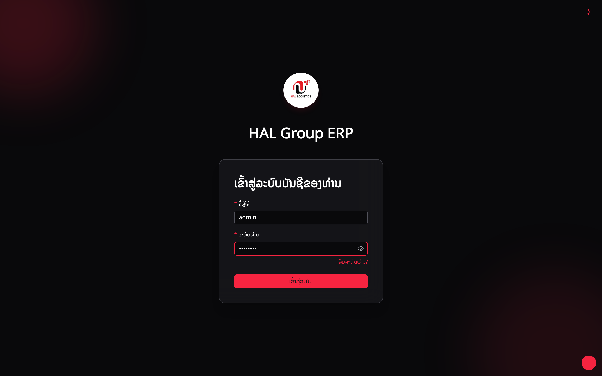
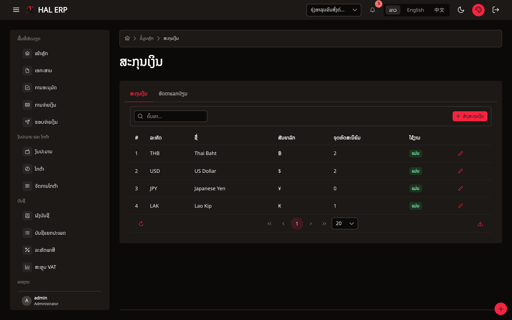
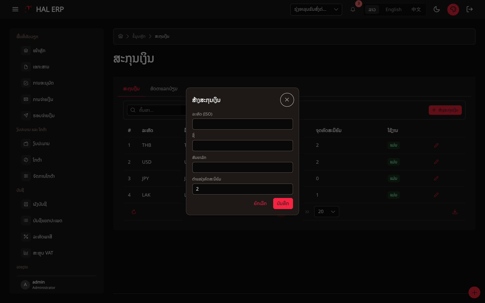
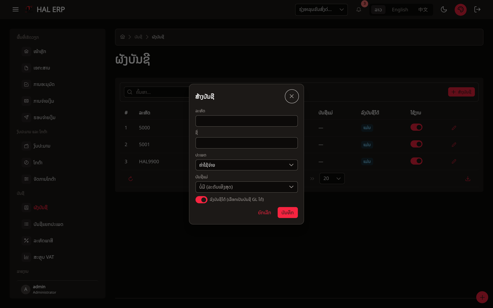
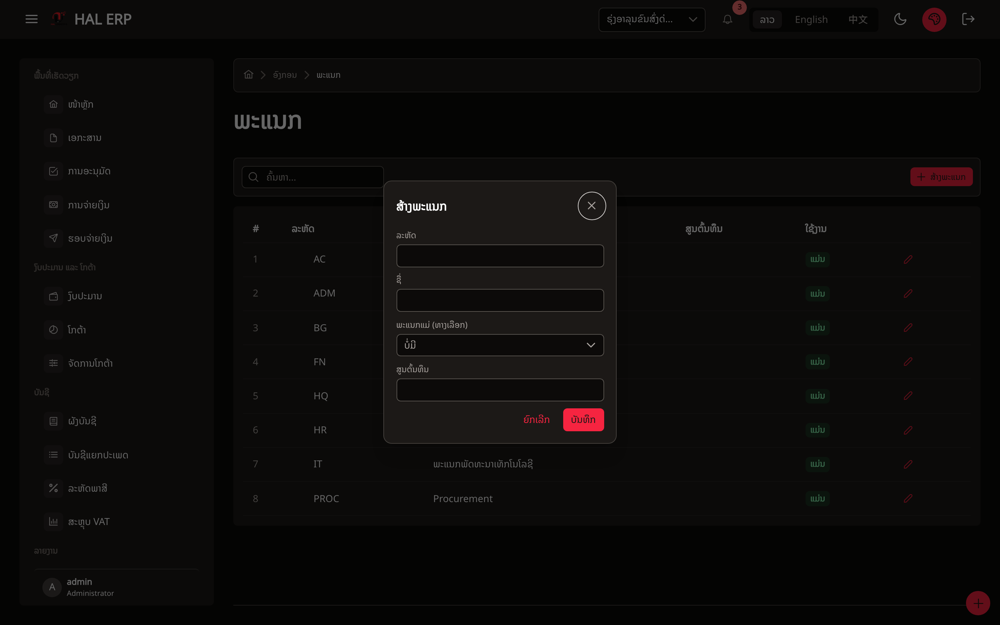
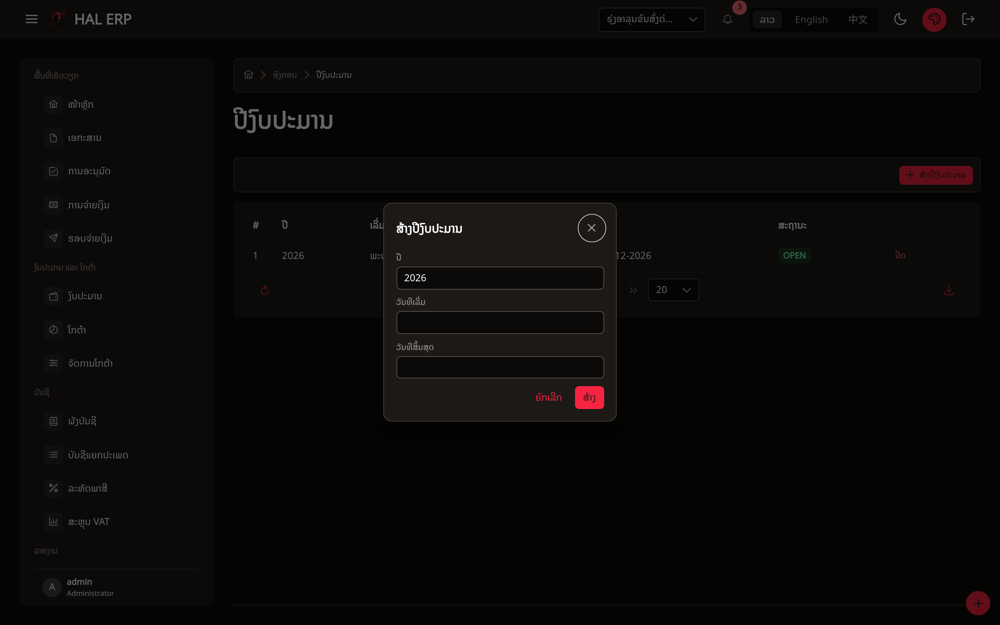
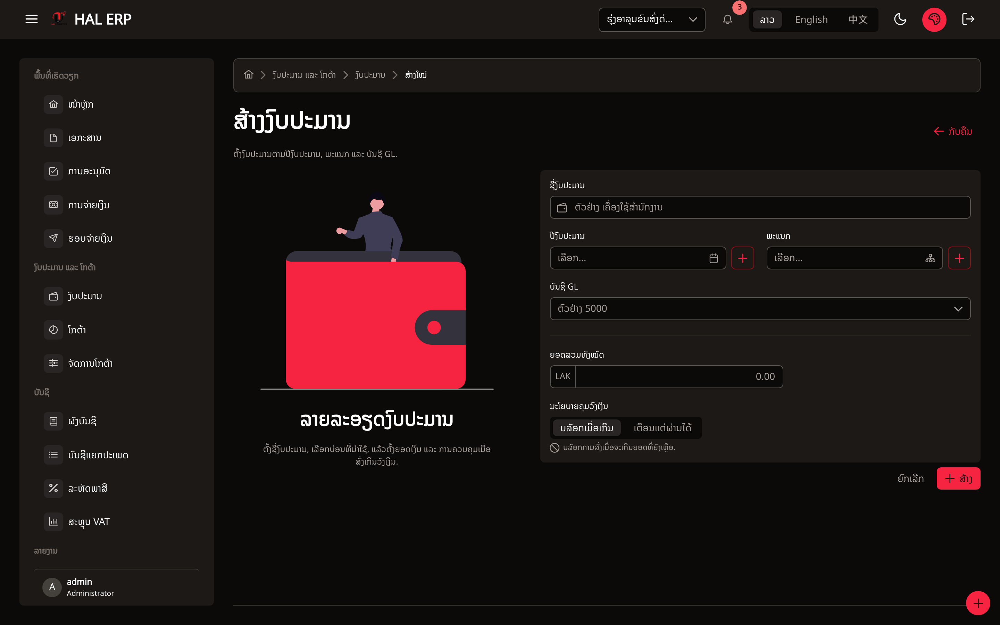

# ຄູ່ມືຂັ້ນຕອນການຕັ້ງຄ່າ: ບັນຊີ · ການເງິນ · ງບປະມານ

> ເອກະສານນີ້ອະທິບາຍ **ລຳດັບຂັ້ນຕອນ** ການເພີ່ມຂໍ້ມູນ ບັນຊີ (Accounting), ການເງິນ/ສະກຸນເງິນ (Finance/Currency) ແລະ ງບປະມານ (Budget) ໃນລະບົບ ERP —
> ບອກຊັດເຈນວ່າ **ຕ້ອງເພີ່ມອັນໃດກ່ອນ** ແລະ **ເຂົ້າໜ້າ (ເມນູ) ໃດກ່ອນ** ພ້ອມຊ່ອງທີ່ຕ້ອງຕື່ມ ເພື່ອໃຫ້ອະທິບາຍໃຫ້ User ເຂົ້າໃຈງ່າຍທີ່ສຸດ (ເໝາະສຳລັບເຮັດເປັນ PowerPoint).

---

## 0. ພາບລວມ: ເປັນຫຍັງຕ້ອງເຮັດຕາມລຳດັບ?

ຂໍ້ມູນໃນລະບົບແມ່ນ **ອີງກັນເປັນຊັ້ນໆ (Dependency)** — ຖ້າຂ້າມຂັ້ນຕອນ ຈະສ້າງ Dropdown ບໍ່ຂຶ້ນ ຫຼື ບັນທຶກບໍ່ໄດ້. ລຳດັບທີ່ຖືກຕ້ອງຄື:

```
① ສະກຸນເງິນ (Currency)
        ↓  ໃຊ້ເປັນ "ສະກຸນເງິນຫຼັກ" ຂອງບໍລິສັດ
② ບໍລິສັດ (Company)  ── ເລືອກບໍລິສັດທີ່ຈະໃຊ້ງານ (Select Company)
        ↓
③ ຂໍ້ມູນພື້ນຖານ 3 ຢ່າງ (ເຮັດຂະໜານກັນໄດ້):
     ┌── ຜັງບັນຊີ (Chart of Accounts)   ← ໝວດ "ບັນຊີ"
     ├── ພະແນກ (Department)             ← ໝວດ "ອົງກອນ"
     └── ປີງບປະມານ (Fiscal Year)        ← ໝວດ "ອົງກອນ"
        ↓  ທັງ 3 ຢ່າງນີ້ຄືວັດຖຸດິບຂອງງບປະມານ
④ ງບປະມານ (Budget)
```

> **ໃຈຄວາມສຳຄັນ:** ຕ້ອງມີ **ສະກຸນເງິນ → ບໍລິສັດ → (ຜັງບັນຊີ + ພະແນກ + ປີງບປະມານ) → ງບປະມານ**
> ອັດຕາແລກປ່ຽນ (Exchange Rate) ເພີ່ມຕອນໃດກໍ່ໄດ້ ຫຼັງຈາກມີສະກຸນເງິນແລ້ວ.

**ກ່ອນເລີ່ມທຸກຢ່າງ:** ຕ້ອງ **ເຂົ້າສູ່ລະບົບ (Login)** ແລ້ວ **ເລືອກບໍລິສັດ (Select Company)** ກ່ອນສະເໝີ — ຂໍ້ມູນທຸກຢ່າງແຍກຕາມບໍລິສັດ (Company Isolation) ຖ້າຍັງບໍ່ເລືອກ ລະບົບຈະພາໄປໜ້າ *ເລືອກບໍລິສັດ* ໂດຍອັດຕະໂນມັດ. (ສະຫຼັບບໍລິສັດໄດ້ຈາກ Dropdown ມູມເທິງຂວາ)

**📸 ໜ້າເຂົ້າສູ່ລະບົບ (Login):**



---

## ຂັ້ນຕອນ ① — ເພີ່ມ ສະກຸນເງິນ (Currency)  🟢 *ເຮັດກ່ອນສຸດ*

**ເມນູ:** `ຂໍ້ມູນຫຼັກ (Master data) → ສະກຸນເງິນ (Currencies)`
**ໜ້າຈໍ (URL):** `/currency-admin`
**ສິດທີ່ຕ້ອງມີ:** ເບິ່ງ = `CURRENCY_VIEW` · ເພີ່ມ/ແກ້ = `CURRENCY_MANAGE`

ໜ້ານີ້ມີ 2 ແຖບ (Tab): **ສະກຸນເງິນ (Currencies)** ແລະ **ອັດຕາແລກປ່ຽນ (Exchange Rates)**.

### 1.1 ເພີ່ມສະກຸນເງິນ — ກົດ "New currency"

| ຊ່ອງ | ຄຳອະທິບາຍ | ຕົວຢ່າງ |
|---|---|---|
| **Code (ລະຫັດ ISO)** | ລະຫັດ 3 ຕົວອັກສອນ — **ແກ້ຄືນບໍ່ໄດ້ຫຼັງບັນທຶກ** | `LAK`, `THB`, `USD` |
| **Name (ຊື່)** | ຊື່ເຕັມສະກຸນເງິນ | `ກີບລາວ`, `ໂດລາ ສະຫະລັດ` |
| **Symbol (ສັນຍາລັກ)** | ສັນຍາລັກ (ບໍ່ບັງຄັບ) | `₭`, `฿`, `$` |
| **Decimal places (ຈຳນວນຈຸດທົດສະນິຍົມ)** | 0–6 ຕຳແໜ່ງ ຄ່າເລີ່ມຕົ້ນ = 2 | LAK = `0` · USD = `2` |

> 💡 **ຄຳແນະນຳ:** ໃສ່ Decimal places ໃຫ້ຖືກ — ກີບ (LAK) ບໍ່ມີສະຕາງ ໃຫ້ໃສ່ `0`, ໂດລາ/ບາດ ໃສ່ `2`. ຕົວເລກນີ້ຄວບຄຸມການສະແດງຈຳນວນເງິນທົ່ວທັງລະບົບ.

**📸 ໜ້າລາຍການສະກຸນເງິນ:**



**📸 ຟອມສ້າງສະກຸນເງິນໃໝ່ (ກົດ "ສ້າງສະກຸນເງິນ"):**



### 1.2 (ທາງເລືອກ) ເພີ່ມອັດຕາແລກປ່ຽນ — ແຖບ "Exchange Rates" → "Add rate"

ເຮັດເມື່ອບໍລິສັດໃຊ້ຫຼາຍສະກຸນເງິນ. ຕ້ອງມີສະກຸນເງິນ (1.1) ກ່ອນ Dropdown ຈຶ່ງຂຶ້ນ.

| ຊ່ອງ | ຄຳອະທິບາຍ |
|---|---|
| **From currency** | ຈາກສະກຸນເງິນ (ເລືອກຈາກທີ່ມີ) |
| **To currency** | ໄປສະກຸນເງິນ (ເລືອກຈາກທີ່ມີ) |
| **Rate (ອັດຕາ)** | ຕົວເລກອັດຕາແລກປ່ຽນ |
| **Rate date (ວັນທີມີຜົນ)** | ວັນທີເລີ່ມໃຊ້ອັດຕານີ້ |
| **Rate type** | ປະເພດ (ຄ່າເລີ່ມຕົ້ນ = DAILY) |
| **Source** | ແຫຼ່ງທີ່ມາ (ບໍ່ບັງຄັບ) |

> 🔒 ລະບົບຈະ **ລັອກອັດຕາແລກປ່ຽນຕອນສົ່ງເອກະສານ** ແລ້ວບໍ່ຄິດໄລ່ຄືນ — ສ່ວນຕ່າງຕອນຈ່າຍເງິນຈະລົງເປັນ FX Gain/Loss ໃນບັນຊີ.

---

## ຂັ້ນຕອນ ② — ສ້າງ/ເລືອກ ບໍລິສັດ (Company)

**ເມນູ:** `ອົງກອນ (Organization) → ບໍລິສັດ (Companies)`
**ໜ້າຈໍ (URL):** `/org-admin/companies` → ກົດ "New" (`/org-admin/companies/new`)
**ສິດທີ່ຕ້ອງມີ:** ເບິ່ງ = `COMPANY_VIEW` · ສ້າງ/ແກ້ = `COMPANY_MANAGE`

ຟອມເປັນແບບ 2 ຂັ້ນຕອນ (Wizard):

### ຂັ້ນ 1 — ຂໍ້ມູນລະບຸຕົວຕົນ (ຕ້ອງຜ່ານກ່ອນຈຶ່ງໄປຂັ້ນ 2)
| ຊ່ອງ | ຄຳອະທິບາຍ |
|---|---|
| **Code** | ລະຫັດບໍລິສັດ — **ແກ້ຄືນບໍ່ໄດ້** |
| **Branch code** | ລະຫັດສາຂາ (ຄ່າເລີ່ມຕົ້ນ `00000`) |
| **Name (TH/LA)** | ຊື່ພາສາລາວ/ໄທ |
| **Name (EN)** | ຊື່ພາສາອັງກິດ |
| **Tax ID** | ເລກປະຈຳຕົວຜູ້ເສຍພາສີ |
| **Base currency (ສະກຸນເງິນຫຼັກ)** | ⭐ ເລືອກຈາກສະກຸນເງິນທີ່ສ້າງໄວ້ໃນຂັ້ນ ① — **ນີ້ຄືເຫດຜົນທີ່ຕ້ອງເຮັດສະກຸນເງິນກ່ອນ** |

### ຂັ້ນ 2 — ຂໍ້ມູນຕິດຕໍ່ (ຫົວກະດາດ)
`Address`, `Phone`, `Email`, `Website` — (ໂລໂກ້ອັບໂຫຼດໄດ້ຫຼັງສ້າງແລ້ວ ໃນໜ້າແກ້ໄຂ)

> 👉 ຫຼັງສ້າງບໍລິສັດແລ້ວ ຢ່າລືມ **ເລືອກບໍລິສັດ (Select Company)** ຢູ່ມູມເທິງ ເພື່ອເຂົ້າໃຊ້ງານບໍລິສັດນັ້ນ. ຖ້າໃຊ້ບໍລິສັດເກົ່າທີ່ມີຢູ່ແລ້ວ ຂ້າມຂັ້ນນີ້ໄປ ພຽງແຕ່ເລືອກບໍລິສັດ.

---

## ຂັ້ນຕອນ ③ — ຂໍ້ມູນພື້ນຖານ 3 ຢ່າງ (ວັດຖຸດິບຂອງງບປະມານ)

ງບປະມານ 1 ລາຍການ = **ປີງບປະມານ + ພະແນກ + ບັນຊີ GL + ຈຳນວນເງິນ**
ສະນັ້ນ ຕ້ອງກຽມ 3 ຢ່າງນີ້ໃຫ້ພ້ອມກ່ອນສ້າງງບປະມານ. (ເຮັດຢ່າງໃດກ່ອນກໍ່ໄດ້ ບໍ່ຈຳເປັນຕ້ອງລຳດັບ)

### 3A. ຜັງບັນຊີ (Chart of Accounts) 📒 — *ໝວດ "ບັນຊີ"*

**ເມນູ:** `ບັນຊີ (Accounting) → ຜັງບັນຊີ (Chart of Accounts)`
**ໜ້າຈໍ (URL):** `/accounts`
**ສິດ:** ເບິ່ງ = `COA_VIEW` · ເພີ່ມ/ແກ້ = `COA_MANAGE`

ກົດ **"New account"**:

| ຊ່ອງ | ຄຳອະທິບາຍ | ຕົວຢ່າງ |
|---|---|---|
| **Code (ລະຫັດບັນຊີ)** | ເລກທີບັນຊີ — **ແກ້ຄືນບໍ່ໄດ້** | `5100` |
| **Name (ຊື່ບັນຊີ)** | ຊື່ບັນຊີ | `ຄ່າໃຊ້ຈ່າຍຫ້ອງການ` |
| **Account type (ປະເພດ)** | ເລືອກ: Asset / Liability / Equity / Revenue / **Expense** (ຄ່າເລີ່ມຕົ້ນ = Expense) | `Expense` |
| **Parent (ບັນຊີແມ່)** | ບັນຊີແມ່ (ບໍ່ບັງຄັບ — ໃຊ້ຈັດເປັນຊັ້ນ) | `5000 ຄ່າໃຊ້ຈ່າຍ` |
| **Is postable (ລົງລາຍການໄດ້)** | ເປີດ = ໃຊ້ລົງລາຍການ/ຜູກງບໄດ້ (ຄ່າເລີ່ມຕົ້ນ = ເປີດ) | ✅ |

> 💡 ບັນຊີທີ່ຈະເອົາໄປ **ຜູກກັບງບປະມານ** ຕ້ອງເປັນບັນຊີທີ່ **Is postable = ເປີດ** ເທົ່ານັ້ນ (ບັນຊີແມ່ທີ່ເປັນພຽງຫົວຂໍ້ ບໍ່ຄວນເປີດ postable).

**📸 ໜ້າຜັງບັນຊີ + ຟອມສ້າງບັນຊີໃໝ່:**



### 3B. ພະແນກ (Department) 🏢 — *ໝວດ "ອົງກອນ"*

**ເມນູ:** `ອົງກອນ (Organization) → ພະແນກ (Departments)`
**ໜ້າຈໍ (URL):** `/org-admin/departments`
**ສິດ:** ເບິ່ງ = `COMPANY_VIEW` · ຈັດການ = `DEPARTMENT_MANAGE`

ເປັນຕາຕະລາງແບບຕົ້ນໄມ້ (Tree) — ກົດເພີ່ມ:

| ຊ່ອງ | ຄຳອະທິບາຍ |
|---|---|
| **Dept code (ລະຫັດພະແນກ)** | ລະຫັດພະແນກ |
| **Name (ຊື່)** | ຊື່ພະແນກ |
| **Cost center (ສູນຕົ້ນທຶນ)** | ບໍ່ບັງຄັບ |
| **Parent (ພະແນກແມ່)** | ພະແນກແມ່ (ບໍ່ບັງຄັບ — ຈັດເປັນຊັ້ນ) |

**📸 ໜ້າພະແນກ + ຟອມສ້າງພະແນກໃໝ່:**



### 3C. ປີງບປະມານ (Fiscal Year) 📅 — *ໝວດ "ອົງກອນ"*

**ເມນູ:** `ອົງກອນ (Organization) → ປີງບປະມານ (Fiscal years)`
**ໜ້າຈໍ (URL):** `/org-admin/fiscal-years`
**ສິດ:** ເບິ່ງ = `COMPANY_VIEW` · ຈັດການ = `FISCAL_YEAR_MANAGE`

| ຊ່ອງ | ຄຳອະທິບາຍ | ຕົວຢ່າງ |
|---|---|---|
| **Year (ປີ)** | ປີງບປະມານ | `2026` |
| **Start date (ວັນທີເລີ່ມ)** | ວັນເລີ່ມຕົ້ນປີ | `2026-01-01` |
| **End date (ວັນທີສິ້ນສຸດ)** | ວັນສິ້ນສຸດປີ | `2026-12-31` |

**📸 ໜ້າປີງບປະມານ + ຟອມສ້າງປີໃໝ່:**



---

## ຂັ້ນຕອນ ④ — ສ້າງ ງບປະມານ (Budget)  🎯 *ຂັ້ນສຸດທ້າຍ*

**ເມນູ:** `ງບປະມານ ແລະ ໂກຕ້າ (Budget & Quota) → ງບປະມານ (Budgets)`
**ໜ້າຈໍ (URL):** `/budgets` → ກົດ "New" (`/budgets/new`)
**ສິດ:** ເບິ່ງ = `BUDGET_VIEW` · ສ້າງ/ແກ້ = `BUDGET_MANAGE`

ຕື່ມຟອມ:

| ຊ່ອງ | ຄຳອະທິບາຍ | ມາຈາກຂັ້ນ |
|---|---|---|
| **Budget name (ຊື່ງບປະມານ)** | ຕັ້ງຊື່ງບປະມານ | — |
| **Fiscal year (ປີງບປະມານ)** | ເລືອກປີງບປະມານ | ③C *(ມີປຸ່ມ "+" ສ້າງໄດ້ທັນທີ)* |
| **Department (ພະແນກ)** | ເລືອກພະແນກ | ③B *(ມີປຸ່ມ "+" ສ້າງໄດ້ທັນທີ)* |
| **GL account (ບັນຊີ)** | ເລືອກບັນຊີ (ສະເພາະ postable) | ③A *(ຕ້ອງສ້າງລ່ວງໜ້າ — ບໍ່ມີປຸ່ມ "+")* |
| **Amount total (ຍອດເງິນ)** | ⭐ ຍອດງບປະມານ — **ໃສ່ໄດ້ຕອນສ້າງເທົ່ານັ້ນ** (ຕໍ່ໄປແກ້ໄດ້ພຽງຜ່ານການ ປັບງບ/Adjust) ໜ່ວຍເປັນສະກຸນເງິນຫຼັກຂອງບໍລິສັດ | ① + ② |
| **Control policy (ນະໂຍບາຍຄວບຄຸມ)** | `HARD_STOP` (ຫ້າມເກີນງບ — ຄ່າເລີ່ມຕົ້ນ) ຫຼື `SOFT_WARNING` (ເຕືອນ ແຕ່ຍັງໄປຕໍ່ໄດ້) | — |

> ⭐ **ຈຸດສຳຄັນ:** ຊ່ອງ **Amount total ໃສ່ໄດ້ຄັ້ງດຽວຕອນສ້າງ** — ຫຼັງຈາກນັ້ນ ຍອດງບຈະປ່ຽນຜ່ານ **ບັນຊີ Ledger (ບັນທຶກຢ່າງດຽວ)** ເທົ່ານັ້ນ ຄື ຈອງ (Reserve) → ຕັດຈິງ (Actual) → ຄືນ (Release) ຫຼື ໂອນ/ປັບງບ. **ຫ້າມແກ້ຍອດງບໂດຍກົງ** — ນີ້ຄືຫຼັກການ Append-only ທີ່ເຮັດໃຫ້ກວດສອບຍ້ອນຫຼັງໄດ້ 100%.

**📸 ໜ້າສ້າງງບປະມານ (ຟອມເຕັມ):**



---

## 5. ສະຫຼຸບເປັນຕາຕະລາງ (ສຳລັບ Slide ດຽວ)

| ລຳດັບ | ເພີ່ມຫຍັງ | ເມນູ | ໜ້າຈໍ | ຕ້ອງມີກ່ອນ |
|:--:|---|---|---|---|
| **①** | ສະກຸນເງິນ | ຂໍ້ມູນຫຼັກ → ສະກຸນເງິນ | `/currency-admin` | (ບໍ່ມີ — ເລີ່ມກ່ອນສຸດ) |
| **②** | ບໍລິສັດ | ອົງກອນ → ບໍລິສັດ | `/org-admin/companies` | ① ສະກຸນເງິນ |
| **③A** | ຜັງບັນຊີ | ບັນຊີ → ຜັງບັນຊີ | `/accounts` | ② ບໍລິສັດ |
| **③B** | ພະແນກ | ອົງກອນ → ພະແນກ | `/org-admin/departments` | ② ບໍລິສັດ |
| **③C** | ປີງບປະມານ | ອົງກອນ → ປີງບປະມານ | `/org-admin/fiscal-years` | ② ບໍລິສັດ |
| **④** | ງບປະມານ | ງບປະມານ → ງບປະມານ | `/budgets/new` | ③A + ③B + ③C |

---

## 6. ຄຳຖາມທີ່ພົບເລື້ອຍ (ໃສ່ໃນ Slide ທ້າຍ)

**ຖາມ: ເປັນຫຍັງ Dropdown ບັນຊີ/ພະແນກ/ປີງບ ໃນໜ້າສ້າງງບປະມານ ບໍ່ຂຶ້ນ?**
ຕອບ: ຍັງບໍ່ໄດ້ສ້າງຂໍ້ມູນນັ້ນໃນຂັ້ນ ③ ຫຼື ຍັງບໍ່ໄດ້ເລືອກບໍລິສັດຖືກ. (ພະແນກ ແລະ ປີງບ ມີປຸ່ມ "+" ສ້າງໄດ້ທັນທີໃນໜ້ານັ້ນ ແຕ່ບັນຊີ ຕ້ອງໄປສ້າງທີ່ໜ້າ `/accounts` ກ່ອນ)

**ຖາມ: ໃສ່ຍອດງບຜິດ ຈະແກ້ແນວໃດ?**
ຕອບ: ຫຼັງສ້າງແລ້ວ ຍອດງບແກ້ໂດຍກົງບໍ່ໄດ້ — ຕ້ອງໃຊ້ຟັງຊັນ **ປັບງບ (Adjust)** ຫຼື **ໂອນງບ (Transfer)** ເຊິ່ງຈະບັນທຶກເປັນລາຍການໃໝ່ໃນ Ledger (ກວດສອບໄດ້).

**ຖາມ: Base currency ຂອງບໍລິສັດ ປ່ຽນຄືນໄດ້ບໍ?**
ຕອບ: ຄວນເລືອກໃຫ້ຖືກຕັ້ງແຕ່ຕອນສ້າງ — ເພາະຍອດງບປະມານທັງໝົດອີງໃສ່ສະກຸນເງິນຫຼັກນີ້.

**ຖາມ: HARD_STOP ຕ່າງກັບ SOFT_WARNING ແນວໃດ?**
ຕອບ: `HARD_STOP` = ຫ້າມສົ່ງເອກະສານທີ່ເກີນງບ. `SOFT_WARNING` = ເຕືອນວ່າເກີນ ແຕ່ຍັງອະນຸຍາດໃຫ້ໄປຕໍ່ໄດ້.

---

> 📌 **ໝາຍເຫດການເຮັດ Slide:** ແນະນຳ 1 ຂັ້ນຕອນ = 1–2 Slide ພ້ອມ screenshot ໜ້າຈໍຈິງ.
> ຮູບໜ້າຈໍທັງໝົດຢູ່ໃນໂຟນເດີ [`docs/screenshots/`](screenshots/) (ຖ່າຍຈາກບໍລິສັດ **ຣຸ່ງອາລຸນຂົນສົ່ງດ່ວນ** ຈິງ) — ດຶງໄປວາງໃສ່ PowerPoint ໄດ້ເລີຍ.

---

## 7. ລາຍການຮູບໜ້າຈໍທັງໝົດ (ໃນ `docs/screenshots/`)

| ໄຟລ໌ຮູບ | ໜ້າຈໍ |
|---|---|
| `00-login.png` | ໜ້າເຂົ້າສູ່ລະບົບ |
| `10-currency-list.png` | ລາຍການສະກຸນເງິນ |
| `11-currency-new-dialog.png` | ຟອມສ້າງສະກຸນເງິນ |
| `20-accounts-list.png` | ຜັງບັນຊີ (ລາຍການ) |
| `21-account-new-dialog.png` | ຟອມສ້າງບັນຊີ |
| `30-departments-list.png` | ພະແນກ (ລາຍການ) |
| `31-department-new-dialog.png` | ຟອມສ້າງພະແນກ |
| `40-fiscal-years-list.png` | ປີງບປະມານ (ລາຍການ) |
| `41-fiscal-year-new-dialog.png` | ຟອມສ້າງປີງບປະມານ |
| `50-budget-list.png` | ງບປະມານ (ລາຍການ) |
| `51-budget-new-form.png` | ຟອມສ້າງງບປະມານ |
| `02-dashboard.png` | ໜ້າ Dashboard (ຫຼັງເຂົ້າສູ່ລະບົບ) |
