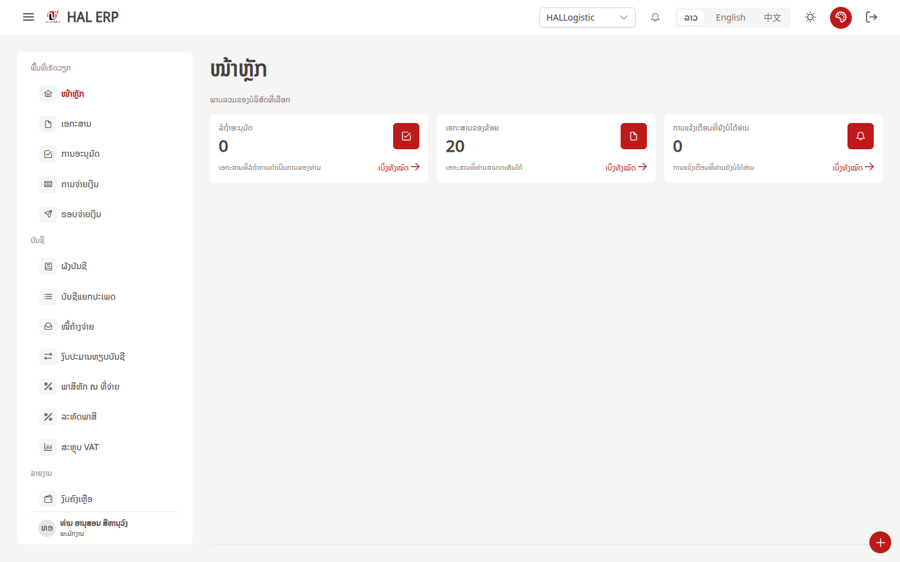
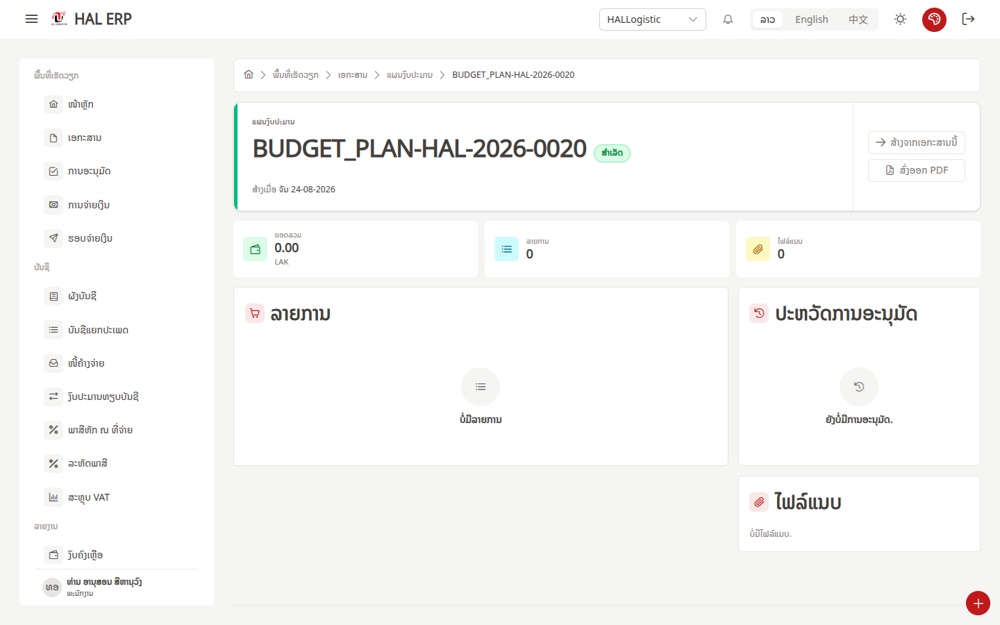
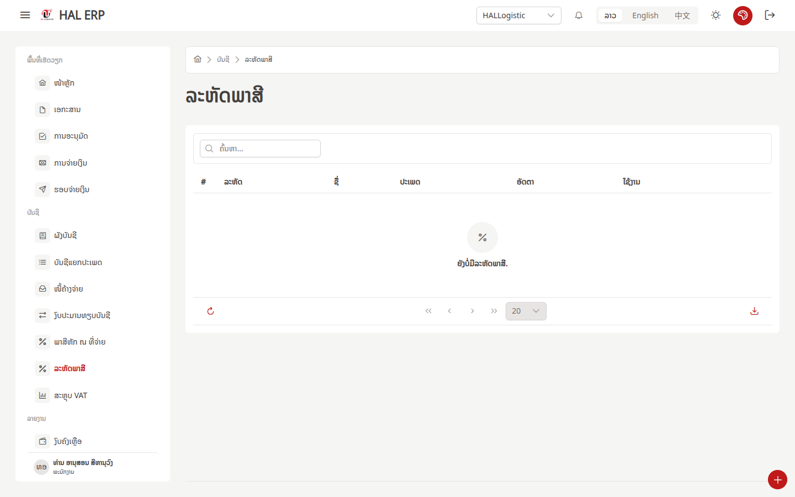
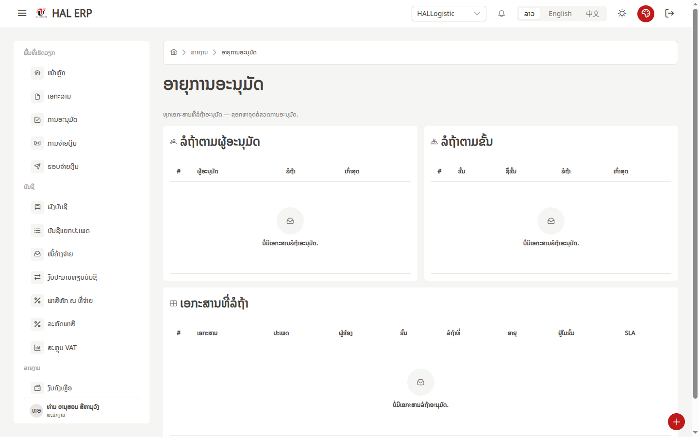
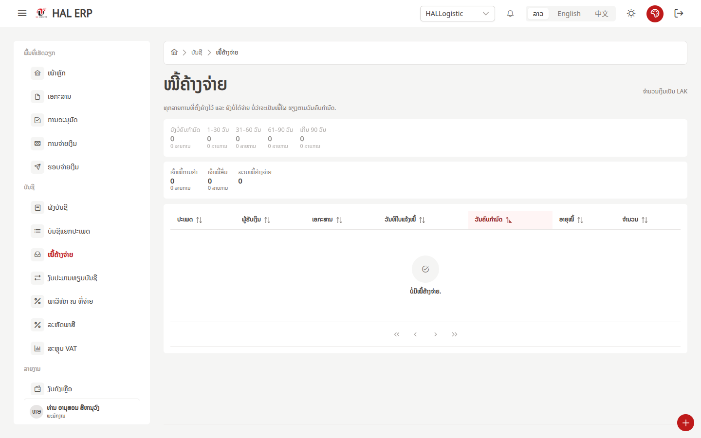
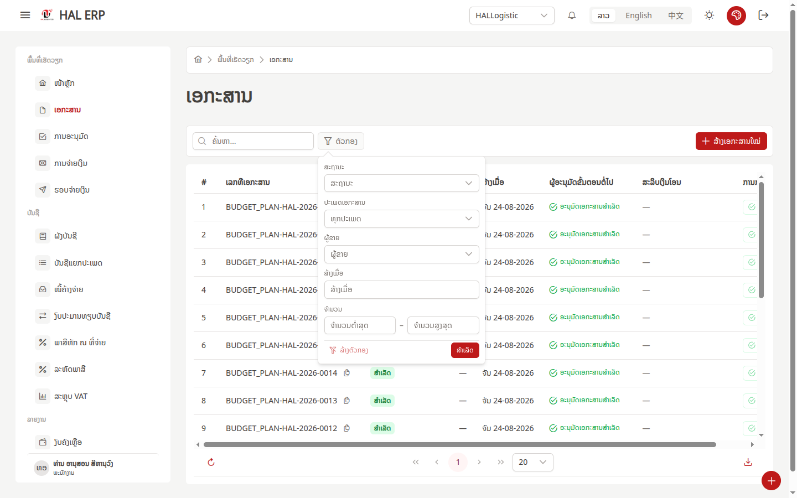
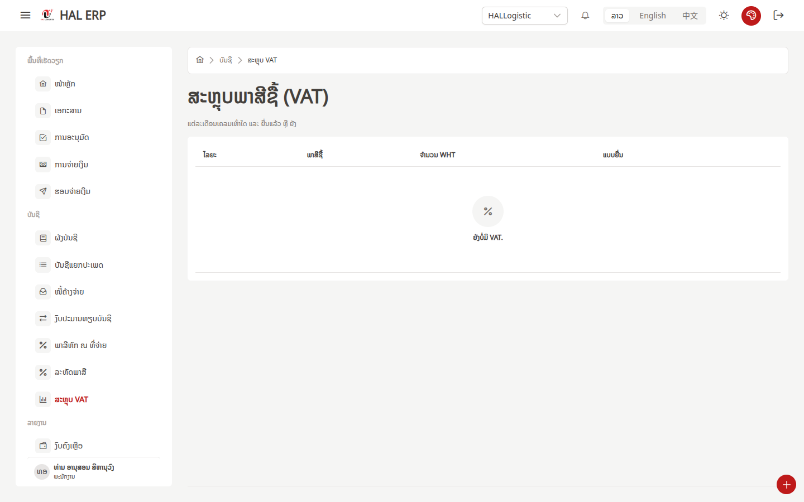
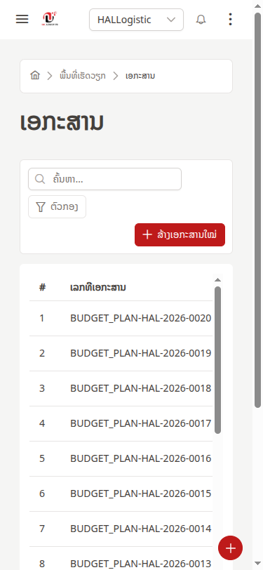
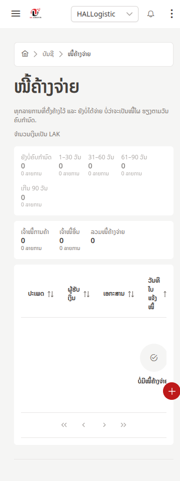

# UX review — บทบาทพนักงานบัญชี (HAL ERP)

**วันที่** 2026-08-25 · **ผู้ใช้ทดสอบ** `anousone` (ທ່ານ ອານຸສອນ ສີຫານຸວົງ) @ ພະແນກບັນຊີ
**Role** `ACCOUNTING` (สร้างใหม่ในเฟส 2) + `STAFF` ที่คาอยู่ · **บริษัท** HALLogistic
**สิทธิ์** `GL_VIEW` `PAYMENT_VIEW` `PAYMENT_BATCH_VIEW` `TAX_VIEW` `COA_VIEW` `REPORT_VIEW` `DOC_VIEW` `DOC_APPROVE` `MASTER_VIEW` = COMPANY · `NOTIFICATION_VIEW` = DEPARTMENT
**Viewport** 1440×900 แล้วทำซ้ำที่ 375×812 · **ข้อมูล** restore จาก production

วิธีทดสอบ: สวมบทพนักงานบัญชีเข้าใหม่ รู้งานบัญชีดีแต่ไม่เคยเห็นระบบนี้ ไม่มีคนสอน
เดินไล่ทุกเมนูใน sidebar แล้วพยายามตอบคำถามหน้างานด้วยตัวเอง ไม่เปิดคู่มือ ไม่อ่านโค้ด

> **ขอบเขตที่จำกัดผลการทดสอบ** — ฐานข้อมูลชุดนี้มีเอกสารที่บัญชีมองเห็นแค่ 20 ใบ
> เป็น `BUDGET_PLAN` ทั้งหมด มูลค่ารวม 0 และไม่มี payables / payment / journal / VAT
> สักรายการ ข้อสังเกตเรื่อง "คอลัมน์พอตัดสินใจมั้ย" จึงอ่านจากโครงคอลัมน์ ไม่ใช่จากแถวจริง

---

## สรุปคำตอบ 5 คำถามหน้างาน

| คำถาม | ตอบได้เองมั้ย | ใช้เวลา / ที่ไปเจอ |
|---|---|---|
| มีเอกสารรอผมตรวจกี่ใบ ดูจากตรงไหน | **ได้** | หน้าแรก การ์ด `ລໍຖ້າອະນຸມັດ` = 0 → กด ເບິ່ງທັງໝົດ ไป `ການອະນຸມັດ` ยืนยัน 0 |
| ผมจะรู้ได้ยังไงว่าใบไหนเอกสารแนบไม่ครบ | **ไม่ได้** | ต้องเปิดทีละใบเพื่อดูไทล์ `ໄຟລ໌ແນບ` ไม่มีคอลัมน์ ไม่มีตัวกรอง 20 ใบ = 20 คลิก |
| ถ้าเจอใบที่ผิด ผมส่งกลับไปให้คนตั้งเบิกแก้ยังไง | **ไม่ได้** | หาไม่เจอทั้งระบบ — ดูรายละเอียด §1.4 |
| ผมดูประวัติว่าใครอนุมัติอะไรไปแล้วบ้างได้จากไหน | **ไม่ได้** | `ອາຍຸການອະນຸມັດ` เป็นคิวที่ *ยังรอ* ไม่ใช่ประวัติ · ประวัติในเอกสารว่างเปล่า §1.1 |
| เลข 0 กับ 20 บนหน้าแรกหมายถึงอะไร เดาจาก UI ได้มั้ย | **ได้บางส่วน** | 0 = รออนุมัติ · 20 = จำนวนเอกสารที่มองเห็น แต่ป้ายเขียนว่า "ຂອງຂ້ອຍ" §3.3 |

---

## ระดับ 1 — บล็อกงานบัญชี ทำต่อไม่ได้จริง ๆ

### 1.1 เอกสารสถานะ "ສຳເລັດ" แต่ประวัติการอนุมัติว่างเปล่า ทั้ง 20 ใบ

`BUDGET_PLAN-HAL-2026-0020` ขึ้นสถานะ **ສຳເລັດ** และในตารางเขียนว่า **ອະນຸມັດເອກະສານສຳເລັດ**
แต่เปิดเข้าไปแล้วกล่อง **ປະຫວັດການອະນຸມັດ** บอกว่า **"ຍັງບໍ່ມີການອະນຸມັດ."**

สำหรับคนบัญชีนี่คือสิ่งที่น่ากลัวที่สุดในระบบ — เอกสารปิดจ๊อบแล้วแต่ไม่มีร่องรอยว่าใครอนุมัติ
ถ้าผู้ตรวจสอบถามว่า "ใครอนุมัติแผนงบ 20 ใบนี้" ผมตอบไม่ได้ และหน้าจอก็ไม่ได้บอกว่า
"ใบนี้นำเข้ามา ไม่ได้ผ่าน workflow" — มันแค่เงียบ

*(รีวิวรอบก่อนของ budget officer เจอจุดเดียวกัน — `ux-review/07-completed-no-approval-history.png`)*

### 1.2 ปิดงวดบัญชีไม่มีในระบบ ไม่ว่าจะเป็นใคร

ค้นหาเมนู "ປິດງວດ" ทั่ว sidebar ไม่เจอ มีแต่ `ງວດການລົງເວລາ` ซึ่งเป็นงวดลงเวลา คนละเรื่อง

ตรวจลึกลงไป: backend มีโค้ดครบ (`PERIOD_VIEW` `PERIOD_MANAGE` `PERIOD_CLOSE` `PERIOD_REOPEN`)
และ route `/new/accounting-periods` มีอยู่จริง แต่สิทธิ์ชุดนี้ **ไม่มีอยู่ในแคตตาล็อก 63 สิทธิ์**
ที่หน้า RBAC แจกได้ ผลคือหน้าปิดงวด **เด้งกลับหน้าแรกเงียบ ๆ แม้แต่ตอนเข้าด้วย admin**
เช่นเดียวกับ `/new/journal/voucher` (`GL_JV_POST`) และ `/new/bank-accounts` (`BANK_ACCOUNT_VIEW`)

แปลว่างานบัญชีสามอย่างนี้ทำในระบบไม่ได้เลย: **ปิดงวด · ตั้ง JV เอง · กระทบยอดธนาคาร**

### 1.3 ตารางรหัสภาษีว่างเปล่า

`ລະຫັດພາສີ` ไม่มีข้อมูลสักแถว — ไม่มีรหัส VAT 10% ไม่มีรหัสหัก ณ ที่จ่าย
ถ้ารหัสภาษียังไม่มี ก็คีย์ใบกำกับภาษีไม่ได้ และหน้า VAT / WHT จะว่างตลอดไปโดยไม่ใช่ความผิดของข้อมูล

หน้าจอบอกแค่ "ຍັງບໍ່ມີລະຫັດພາສີ." ไม่ได้บอกว่าใครเป็นคนตั้ง หรือให้ไปขอใคร
และ role นี้มี `TAX_VIEW` แต่ไม่มี `TAX_MANAGE` จึงตั้งเองไม่ได้ — เป็นทางตันเงียบ

### 1.4 ไม่มีทางส่งเอกสารกลับให้คนตั้งเบิกแก้

ในหน้ารายละเอียดเอกสารมีปุ่มแค่สองปุ่ม: **ສ້າງຈາກເອກະສານນີ້** กับ **ສົ່ງອອກ PDF**
ไม่มี ສົ່ງກັບ / ຕີກັບ / ຂໍຂໍ້ມູນເພີ່ມ และไม่มีช่องใส่เหตุผล

ในตาราง `ເອກະສານ` มีคอลัมน์ `ການກະທຳ` แต่มีแค่ปุ่ม **ອະນຸມັດ ที่ disabled ทุกแถว** —
เป็นคอลัมน์ปุ่มตายทั้งคอลัมน์ ซึ่งยิ่งทำให้คิดว่า "ปุ่มปฏิเสธคงอยู่ที่อื่น" แล้วก็หาไม่เจอ

หมายเหตุ: คิวอนุมัติว่างเปล่า จึงยืนยันไม่ได้ว่าปุ่มปฏิเสธมีอยู่ในหน้านั้นหรือไม่ —
แต่ประเด็นคือ **จากจุดที่คนบัญชีเจอเอกสารผิด เขาไปต่อไม่ถูก**

### 1.5 ไม่มีที่ไหนดูประวัติการอนุมัติข้ามเอกสาร

`ລາຍງານ › ອາຍຸການອະນຸມັດ` ชื่อฟังดูใช่ แต่คำโปรยเขียนว่า
"ທຸກເອກະສານທີ່ **ລໍຖ້າ** ອະນຸມັດ — ຊອກຫາຈຸດຄໍຂວດ" — เป็นคิว *ที่ยังค้าง* ไม่ใช่ประวัติ

ประวัติมีที่เดียวคือในเอกสารรายใบ ซึ่งตาม §1.1 ว่างเปล่า
คนบัญชีจึงตอบคำถาม "เดือนนี้ใครอนุมัติอะไรไปบ้าง" ไม่ได้เลย

---

## ระดับ 2 — ทำได้ แต่ช้าเกินควรหรือเสี่ยงตัดสินใจผิด

### 2.1 หน้า payables: คอลัมน์ไม่พอตัดสินใจโดยไม่เปิดทีละใบ

โครงหน้าดีที่สุดในระบบ — มีถัง aging (ຍັງບໍ່ຄົບກຳນົດ / 1–30 / 31–60 / 61–90 / ເກີນ 90)
แยก ເຈົ້າໜີ້ການຄ້າ กับ ເຈົ້າໜີ້ອື່ນ และตารางเรียงตาม ວັນຄົບກຳນົດ มาให้เลย

แต่คอลัมน์ที่มีคือ `ປະເພດ` `ຜູ້ຮັບເງິນ` `ເອກະສານ` `ວັນທີໃບແຈ້ງໜີ້` `ວັນຄົບກຳນົດ` `ອາຍຸໜີ້` `ຈຳນວນ`
สิ่งที่คนบัญชีต้องใช้ตัดสินใจแต่ไม่มี:

| ไม่มี | ทำไมต้องมี |
|---|---|
| **สกุลเงินต้นฉบับ + ยอดต้นฉบับ** | หน้าบังคับ LAK อย่างเดียว (โน้ตเล็ก ๆ มุมขวาบน) ใบแจ้งหนี้ USD จะดูไม่ออกว่ายอดจริงเท่าไร และเทียบกับใบกำกับที่ผู้ขายส่งมาไม่ได้ |
| **เลขที่ใบแจ้งหนี้ / ใบกำกับภาษีของผู้ขาย** | คอลัมน์ `ເອກະສານ` เป็นเลขเอกสารภายใน ตอนโทรตามผู้ขายต้องใช้เลขของเขา |
| **VAT / หัก ณ ที่จ่าย ของใบนั้น** | ยอดที่จะโอนจริง = ยอดหนี้ − WHT ถ้าไม่เห็นก็เตรียมโอนผิด |
| **ยอดจ่ายแล้ว / คงเหลือ** | มีแต่ `ຈຳນວນ` ก้อนเดียว จ่ายบางส่วนแล้วดูไม่ออก |
| **แผนก / ศูนย์ต้นทุน** | เวลามีปัญหาต้องรู้ว่าโทรหาแผนกไหน |
| **สถานะเอกสารแนบ** | ดู §2.2 |
| **บัญชี GL ที่จะลง** | หน้า `ພ້ອມຈ່າຍ` มีคอลัมน์ `ບັນຊີ GL` แต่ payables ไม่มี |

### 2.2 จะรู้ว่าใบไหนเอกสารแนบไม่ครบ ต้องเปิดทีละใบ

จำนวนไฟล์แนบโผล่ที่เดียว — ไทล์ `ໄຟລ໌ແນບ` ในหน้ารายละเอียดเอกสาร
ตาราง `ເອກະສານ` ไม่มีคอลัมน์นี้ ตัวกรองก็ไม่มีเงื่อนไขนี้ และ payables ก็ไม่มี

20 ใบ = เปิด 20 ครั้ง กดถอยกลับ 20 ครั้ง ถ้าเป็นเดือนที่มี 300 ใบก็คูณไป
และไม่มีที่ไหนบอกว่า "เอกสารประเภทนี้ต้องแนบอะไรบ้าง" จึงตัดสินไม่ได้อยู่ดีว่า *ครบ* คือเท่าไร

### 2.3 ตัวกรองเอกสาร 2 ใน 5 ตัวใช้ไม่ได้ และไม่บอกว่าทำไม

กด `ຕົວກອງ` ได้แผงที่มี ສະຖານະ / ປະເພດເອກະສານ / ຜູ້ຂາຍ / ສ້າງເມື່ອ / ຈຳນວນ
แต่กด `ປະເພດເອກະສານ` ขึ้น **"No available options"** และ `ຜູ້ຂາຍ` ก็ **"No available options"** เหมือนกัน
ทั้งที่ในตารางเห็นชัดว่ามีเอกสารประเภท `BUDGET_PLAN` อยู่ 20 ใบ

เดาว่าเป็นเพราะ role นี้ไม่มีสิทธิ์อ่านทะเบียนประเภทเอกสารกับทะเบียนผู้ขาย
แต่หน้าจอไม่ได้บอกแบบนั้น มันแค่ว่างเปล่า — คนใช้จะสรุปว่า "ระบบพัง" ไม่ใช่ "ผมไม่มีสิทธิ์"

### 2.4 หน้าสรุป VAT คำนวณ VAT ที่ต้องชำระไม่ได้ และปนกับ WHT

หัวข้อ **ສະຫຼຸບພາສີຊື້ (VAT)** — พูดถึงภาษีซื้อ
คอลัมน์: `ໄລຍະ` `ພາສີຊື້` `ຈຳນວນ WHT` `ແບບຢື່ນ`

สองปัญหาซ้อนกัน:
1. **ไม่มีภาษีขาย** — VAT ที่ต้องนำส่ง = ภาษีขาย − ภาษีซื้อ หน้านี้มีแค่ครึ่งเดียวจึงยื่นแบบไม่ได้
2. **เอา WHT มาไว้ในหน้า VAT** — เป็นภาษีคนละตัว คนละแบบยื่น คนละกำหนดส่ง
   และมีหน้า `ພາສີຫັກ ณ ທີ່ຈ່າຍ` แยกอยู่แล้ว จะดู WHT ต้องดูสองที่แล้วเลขไหนถูก

### 2.5 ที่ 375px ตารางเอกสารเหลือแค่ 2 คอลัมน์

ตาราง `ເອກະສານ` ที่จอมือถือแสดงแค่ `#` กับ `ເລກທີເອກະສານ`
สถานะ / ยอด / วันที่ / ผู้อนุมัติขั้นถัดไป หลุดออกไปหลังการเลื่อนแนวนอนทั้งหมด
ไม่มีการยุบเป็นการ์ดแบบ mobile — คนบัญชีที่เปิดจากมือถือเห็นแค่รายการเลขเอกสาร คัดกรองอะไรไม่ได้เลย

### 2.6 ที่ 375px ข้อความ "ไม่มีข้อมูล" หลุดออกนอกจอและถูกปุ่มลอยทับ

หน้า payables ที่ 375px: ข้อความ `ບໍ່ມີໜີ້ຄ້າງຈ່າຍ.` ไปอยู่ชิดขอบขวา ถูกตัดครึ่ง
และมีปุ่มลอยสีแดง (+) ทับอยู่ด้านบน — เพราะ empty state จัดกึ่งกลางตาม *ความกว้างจริงของตาราง*
ไม่ใช่ความกว้างจอ พอตารางกว้างกว่าจอ ข้อความเลยไปโผล่นอกจอ

---

## ระดับ 3 — คำใน UI ที่ไม่ตรงกับที่คนทำงานจริงพูด

| ที่เห็นในจอ | ปัญหา | ที่ควรจะเป็น (ในภาษาคนบัญชี) |
|---|---|---|
| `ພາສີຫັກ ณ ທີ່ຈ່າຍ` | **ตัว `ณ` เป็นอักษรไทย** อยู่กลางข้อความลาว | ใช้อักษรลาวทั้งบรรทัด |
| `ຈຳນວນ WHT` (หน้า VAT) | ย่อภาษาอังกฤษดิบ ในจอภาษาลาว และเรียกสิ่งเดียวกันคนละชื่อกับ sidebar | ใช้ `ພາສີຫັກທີ່ຈ່າຍ` ให้ตรงกันทั้งระบบ |
| `SLA` (คอลัมน์ในอายุการอนุมัติ) | ย่ออังกฤษดิบ คนบัญชีไม่ได้ใช้คำนี้ | `ກຳນົດເວລາ` หรือ `ຄ້າງກີ່ມື້` |
| `BUDGET_PLAN` (แกนกราฟ) · `FINANCE` (คอลัมน์ ໝວດ) | ค่า enum ดิบไม่แปล ทั้งที่ตารางข้างล่างในหน้าเดียวกันแปลว่า `ແຜນງົບປະມານ` แล้ว | ใช้คำแปลให้เหมือนกันทั้งหน้า |
| `No available options` (dropdown ตัวกรอง) | สตริงอังกฤษของ component หลุดออกมา | ข้อความลาว และควรบอกด้วยว่าว่างเพราะสิทธิ์ |
| sidebar `ການຈ່າຍເງິນ` → หน้าชื่อ `ພ້ອມຈ່າຍ` | เมนูกับหัวข้อหน้าคนละคำ กดแล้วไม่แน่ใจว่ามาถูกที่ | ใช้คำเดียวกัน |
| การ์ดหน้าแรก `ເອກະສານຂອງຂ້ອຍ` แต่คำโปรยว่า "ເອກະສານທີ່ທ່ານສາມາດເຫັນໄດ້" | "ของฉัน" กับ "ที่ฉันเห็นได้" คนละความหมาย — พอเปลี่ยนสิทธิ์เป็นทั้งบริษัท เลข 20 ก็ยิ่งกำกวม | `ເອກະສານທີ່ເຫັນໄດ້` |
| `ລ້າງ` / `ລົງບັນຊີ` ใช้ปนกัน (`ລາຍການລ້າງບັນຊີທີ່ຄ້າງ` เทียบ `ລາຍການລົງບັນຊີທີ່ຄ້າງ`) | ปุ่มกับหัวข้อหน้าที่ปุ่มพาไป ใช้คำต่างกัน | เลือกคำเดียว |

---

## ระดับ 4 — จุดที่ลังเล เดาผิด หรือต้องกดย้อนกลับ (บันทึกดิบ)

เรียงตามลำดับที่เกิดขึ้นจริงระหว่างเดินระบบ

1. **หน้า login เติม `admin` / `HAL@1419` ให้อัตโนมัติ** — เป็นรหัสของ anousone ไม่ใช่ของ admin
   ถ้ากดเข้าเลยจะไม่ผ่านโดยไม่รู้สาเหตุ และมี credential จริงโชว์ในหน้า login ของทุกคน
2. **หาปุ่มออกจากระบบไม่เจอ** — กดแถบชื่อตัวเองมุมล่างซ้ายก่อน เพราะปกติเมนู logout อยู่ตรงนั้น
   แต่มันพาไปหน้าโปรไฟล์ ต้องถอยกลับ ปุ่ม logout จริงคือไอคอนมุมขวาบนที่**ไม่มีชื่อกำกับ**
3. **ชิปโปรไฟล์ยังขึ้น `ພະນັກງານ`** ทั้งที่ถือ role `ACCOUNTING` แล้ว — แสดงแค่ role ที่ติดดาว
   ทำให้ไม่แน่ใจว่าสิทธิ์ใหม่มีผลหรือยัง ต้องไปไล่ดู sidebar เอาเองว่าเมนูเพิ่มขึ้นมั้ย
4. **ตาราง `ຜັງບັນຊີ` คอลัมน์ `ໃຊ້ງານ` ดูเหมือนปิดทุกบัญชี** — ตกใจว่าผังบัญชีถูกปิดหมด
   ความจริงคือ switch อยู่สถานะ `checked` + `disabled` แต่สีที่ render ออกมาแยกไม่ออกจากสถานะปิด
5. **คอลัมน์ `ລົງບັນຊີໄດ້` แสดง `ບໍ່` เป็นตัวอักษรเปล่า แต่ `ແມ່ນ` เป็นป้ายสี** —
   สายตาจับป้ายสีก่อน เลยอ่านผิดว่าบัญชีที่ลงได้มีน้อยกว่าความจริง
6. **ชื่อบัญชียาวถูกตัดกลางคัน** เช่นแถว `10` จบด้วยจุลภาคลอย ๆ ไม่มี tooltip ไม่มีการตัดบรรทัด
7. **หน้า `ລາຍຈ່າຍຕາມຜູ້ຂາຍ` ขึ้น 0 ทั้งหน้าโดยที่ช่วงวันที่ยังว่าง** — แยกไม่ออกว่า
   "ไม่มีข้อมูล" หรือ "ยังไม่ได้เลือกช่วง" และปุ่ม `ສົ່ງອອກ CSV` จาง ๆ กดไม่ได้โดยไม่บอกเหตุผล
8. **โดนัทชาร์ตที่มีชิ้นเดียว 100%** ในรายงานเอกสาร — ไม่ให้ข้อมูลอะไร แต่กินพื้นที่ครึ่งจอ
9. **ไอคอน `$` กำกับตัวเลขที่เป็น LAK** ทั้งในรายงานเอกสารและรายจ่ายตามผู้ขาย
10. **breadcrumb ไม่เปลี่ยนตามหน้า** — เข้าหน้า `ລາຍການລົງບັນຊີທີ່ຄ້າງ` แล้ว breadcrumb ยังเป็น
    `ບັນຊີ › ບັນຊີແຍກປະເພດ` ทำให้ไม่แน่ใจว่าเปลี่ยนหน้าแล้วจริงหรือเปล่า
11. **หน้า `ບັນຊີແຍກປະເພດ` ไม่มีตัวเลือกช่วงวันที่** — งานบัญชีทำงานเป็นงวดเสมอ ไม่มีให้เลือกงวด
12. **แถวสรุปในหน้า `ງົບປະມານທຽບບັນຊີ` ไม่มีชื่อ** — คอลัมน์แรกชื่อ `ບັນຊີ` แต่ในแถวมีแค่ลูกศรกาง
    ตัวเลข 394,685,630,508 ลอยอยู่โดยไม่รู้ว่าเป็นของบัญชีไหน
13. **375px: breadcrumb กินไป 3 บรรทัดแล้วยังตัดคำสุดท้ายทิ้ง** ในหน้ารายละเอียดเอกสาร
14. **375px: ปุ่มลอย (+) ลอยทับเนื้อหากลางหน้า** และยังลอยทับ drawer เมนูตอนเปิด sidebar อยู่
15. **375px: drawer เมนูบังปุ่ม hamburger ของตัวเอง** ปิดได้ทางเดียวคือแตะพื้นที่มืดข้าง ๆ
    และแถบชื่อผู้ใช้ด้านล่างทับรายการเมนูสุดท้าย

**error ที่เกิดจริงแต่ผู้ใช้ไม่เห็นอะไรเลย**
- เปิดรายละเอียดเอกสาร → `GET /api-new/payments/{id}/slips` ตอบ **404** ถูกกลืนเงียบ
- เปิดหน้า `ລາຍຈ່າຍຕາມຜູ້ຂາຍ` → `Failed to create chart: can't acquire context` ถูกกลืนเงียบ

---

## flow ที่ต้องกดเกิน 3 ครั้งกว่าจะถึงเป้าหมาย

| อยากทำ | ต้องกด | นับ |
|---|---|---|
| **รู้ว่าใบไหนเอกสารแนบไม่ครบ** | ເອກະສານ → เปิดใบที่ 1 → อ่านไทล์ → ถอยกลับ → เปิดใบที่ 2 → … | **2 คลิก × จำนวนใบ** (20 ใบ = 40 คลิก) ไม่มีทางลัด |
| **ดูว่าใครอนุมัติเอกสารใบหนึ่ง** | ເອກະສານ → หาใบในตาราง (ไม่มีตัวกรองประเภท) → เปิด → เลื่อนหา ປະຫວັດການອະນຸມັດ | **3–4 คลิก** แล้วได้ผลว่างเปล่า |
| **ดูยอดหนี้ค้างของผู้ขายรายหนึ่ง** | ໜີ້ຄ້າງຈ່າຍ → ไม่มีตัวกรองผู้ขาย → ต้องไปที่ ລາຍງານ › ລາຍຈ່າຍຕາມຜູ້ຂາຍ → เลือกวันที่เริ่ม → เลือกวันที่จบ | **4+ คลิก** และเป็นคนละตัวเลขกับหน้า payables |
| **หาบัญชีคุมเจ้าหนี้ในผังบัญชี** | ຜັງບັນຊີ → ไม่มีตัวกรองประเภท/ลงบัญชีได้ → พิมพ์ค้นหา หรือไล่ทีละหน้า | **สูงสุด 5 หน้า** |
| **เปลี่ยนภาษา / โหมดมืด ที่ 375px** | ⋮ มุมขวาบน → เลือก | 2 คลิก — อันนี้โอเค |

---

## สิ่งที่ role นี้เห็นแต่ไม่ควรเห็น / ควรเห็นแต่ไม่เห็น

### เห็นแต่ไม่ควรเห็น

| รายการ | เหตุผล |
|---|---|
| ปุ่ม **`+ ສ້າງເອກະສານໃໝ່`** และปุ่มลอย (+) ในหน้า `ເອກະສານ` | คนบัญชีเป็นผู้ *ตรวจ* ไม่ใช่ผู้ตั้งเบิก การให้ปุ่มสร้างเด่นสีแดงมุมขวาบนชวนให้บทบาทปนกัน — มาจาก `DOC_CREATE` ของ role `STAFF` ที่ยังคาอยู่ เพราะหน้าจัดการสิทธิ์ **ถอด role เดี่ยวไม่ได้** มีแต่ `ຖອນທັງໝົດ` |
| คอลัมน์ `ການກະທຳ` ที่มีปุ่ม **`ອະນຸມັດ` disabled ทุกแถว** | ถ้ากดไม่ได้ทุกแถวก็ไม่ควรกินคอลัมน์ — และมันทำให้เข้าใจผิดว่าปุ่ม "ปฏิเสธ" น่าจะอยู่แถวนี้ด้วย |
| หน้า `ຂໍ້ມູນຫຼັກ` ทั้งชุด | ได้มาจาก `MASTER_VIEW` scope COMPANY ที่ตั้งไว้ — เกินความจำเป็นของงาน payables |

### ควรเห็นแต่ไม่เห็น

| รายการ | ผลกระทบ |
|---|---|
| **ปิดงวดบัญชี** (`/new/accounting-periods`) | งานปิดเดือนทำในระบบไม่ได้ — เด้งกลับหน้าแรกเงียบแม้แต่ admin (§1.2) |
| **บัญชีธนาคาร + กระทบยอดธนาคาร** (`/new/bank-accounts`, `/new/bank-reconciliation`) | กระทบยอดเงินฝากทำไม่ได้ |
| **ตั้งใบสำคัญทั่วไปเอง** (`/new/journal/voucher`) | ปรับปรุงรายการเองไม่ได้ ต้องรอ post จากเอกสารอย่างเดียว |
| **ประวัติการอนุมัติแบบรวม** | ไม่มีหน้าไหนรองรับ (§1.5) |
| **ผู้สร้าง / แผนกเจ้าของเอกสาร** | ไม่โผล่ทั้งในตารางและในหน้ารายละเอียด — ทำให้ §1.4 (ส่งกลับให้ใคร) ตอบไม่ได้ตั้งแต่ต้น |
| **เมนูแจ้งเตือน** | ไอคอนกระดิ่งมี แต่ `NOTIFICATION_VIEW` ตั้ง scope เป็น DEPARTMENT จึงเห็นเฉพาะของแผนกบัญชี ทั้งที่ต้องตรวจเอกสารทั้งบริษัท |

---

## ภาคผนวก — หน้าจอที่เก็บไว้

**1440px** — [หน้าแรก](ux-review/p3-01-home-1440.png) · [เอกสาร](ux-review/p3-02-documents-1440.png) · [ตัวกรองเอกสาร](ux-review/p3-03-documents-filter-1440.png) · [การอนุมัติ](ux-review/p3-04-approvals-1440.png) · [พร้อมจ่าย](ux-review/p3-05-payments-1440.png) · [รอบจ่ายเงิน](ux-review/p3-06-payment-batches-1440.png) · [หนี้ค้างจ่าย](ux-review/p3-07-payables-1440.png) · [บัญชีแยกประเภท](ux-review/p3-08-journal-1440.png) · [รายการลงบัญชีที่ค้าง](ux-review/p3-09-journal-undelivered-1440.png) · [ผังบัญชี](ux-review/p3-10-accounts-1440.png) · [งบประมาณเทียบบัญชี](ux-review/p3-11-recon-1440.png) · [สรุป VAT](ux-review/p3-12-vat-1440.png) · [หัก ณ ที่จ่าย](ux-review/p3-13-wht-1440.png) · [รายละเอียดเอกสาร](ux-review/p3-14-doc-detail-1440.png) · [อายุการอนุมัติ](ux-review/p3-15-approval-aging-1440.png) · [รายงานเอกสาร](ux-review/p3-16-report-documents-1440.png) · [รหัสภาษี](ux-review/p3-17-tax-codes-1440.png) · [รายจ่ายตามผู้ขาย](ux-review/p3-18-spend-by-vendor-1440.png)

**375px** — [หน้าแรก](ux-review/p3-19-home-375.png) · [เอกสาร](ux-review/p3-20-documents-375.png) · [หนี้ค้างจ่าย](ux-review/p3-21-payables-375.png) · [รายละเอียดเอกสาร](ux-review/p3-22-doc-detail-375.png) · [เมนู drawer](ux-review/p3-23-sidebar-375.png)

**เฟส 2 (การเปลี่ยน role)** — [ก่อน](ux-review/phase2-anousone-current-role.png) · [หลัง](ux-review/phase2-anousone-after-accounting-role.png)
