# UX review — first day as a budget officer

**Who:** `LATTANAPHONE` · ນາງ ລັດຕະນາພອນ ສຸກສາຄອນ · ພະແນກງົບປະມານ (BG), holding the new
`BUDGET_OFFICER` role (12 permissions — `BUDGET_VIEW` `BUDGET_MANAGE` `REPORT_VIEW` `COA_VIEW` at
COMPANY scope, the 8 `STAFF` codes at DEPARTMENT).
**Against:** `real_server`, restored from production, 2026-08-25. 244 budgets, 20 documents, 0 spend
history.
**How:** every sidebar entry walked at 1440×900 and again at 375×812, as somebody who has never seen
the system and has nobody to ask. Nothing was written — no save, no submit, no approve.

No fixes are proposed here, as asked.

---

## The three questions

### ຖ້າຂ້ອຍຕ້ອງຂໍອະນຸມັດງົບ ຂ້ອຍເລີ່ມຈາກໃສ? — **ບໍ່ໄດ້ເລີ່ມ**

She cannot create a document of any kind. Three clicks to find that out: ເອກະສານ →
ສ້າງເອກະສານໃໝ່ → step 1 of 4 says *"ບໍ່ມີປະເພດເອກະສານທີ່ທ່ານສາມາດສ້າງໄດ້ໃນບໍລິສັດນີ້"*.

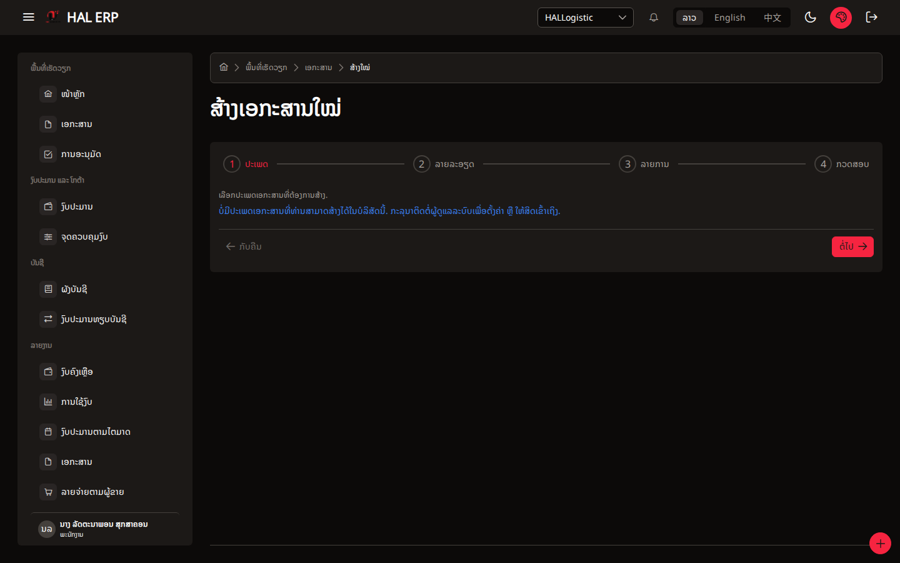

The reason is in the data, not the screen: `dept_doc_type` has rows for exactly **one** department in
the whole company — `PLAN`, the synthetic one the budget-plan import created. Her department has
none, so every document type is unreachable for her.

### ຖ້າຂ້ອຍຕ້ອງເຊັກວ່າເອກະສານທີ່ສົ່ງໄປແລ້ວຢູ່ຂັ້ນໃດ ຂ້ອຍເບິ່ງຈາກໃສ?

Two places, and the first one she will try is the wrong one:

- **ການອະນຸມັດ** — reads *"ບໍ່ມີລາຍການລໍຖ້າການອະນຸມັດຂອງທ່ານ"*. This screen is documents waiting
  for **her** approval, not documents she sent. Nothing on it says so.
- **ເອກະສານ** → the ຜູ້ອະນຸມັດຂັ້ນຕອນຕໍ່ໄປ column, or the document's own ປະຫວັດການອະນຸມັດ panel.

Nothing links the two, and the word ການອະນຸມັດ fits both readings.

### ເລກ 0 ກັບ 20 ໜ້າຫຼັກໝາຍເຖິງຫຍັງ? — **ເດົາຜິດ**

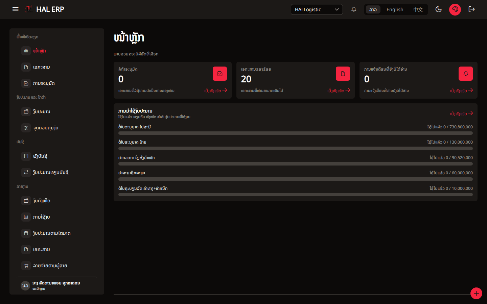

- **0** = ລໍຖ້າອະນຸມັດ, "ເອກະສານທີ່ລໍຖ້າການດຳເນີນການຂອງທ່ານ". Guessable.
- **20** = the card is titled **ເອກະສານຂອງຂ້ອຍ** ("my documents"). She has created **zero**
  documents. Her department has **zero**. The 20 is every document in the company. The card's own
  subtitle says something different from its title — "ເອກະສານທີ່ທ່ານສາມາດເຫັນໄດ້", documents you
  can *see*. Title and subtitle disagree, and only the subtitle is true.

---

## จุดที่สับสน — ordered by severity

### 1. She sees 20 documents that belong to another department

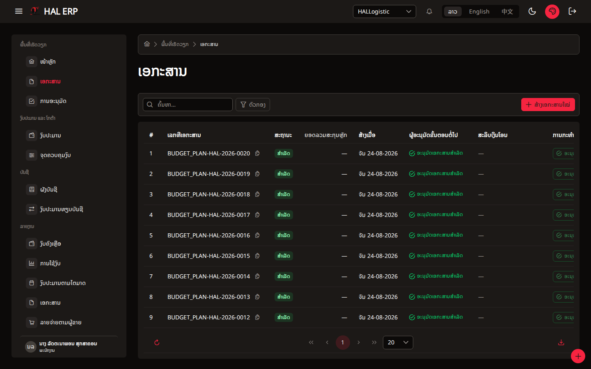

Her `DOC_VIEW` is granted at **DEPARTMENT** scope. Every one of the 20 documents she can list
belongs to department `PLAN`; hers is `BG`; the two are siblings, neither is an ancestor of the
other. She can open all of them.

This is not a display quirk. `DocumentService.list()` builds its query from
`this.scope.forActiveCompany()` — the **company** filter only — and never calls
`scopeWhere('DOC_VIEW', …)`. `ScopeService` implements OWN / DEPARTMENT / COMPANY correctly and the
document list does not ask it. Same for `get()` and `detail()`.

Effect: DEPARTMENT scope on `DOC_VIEW` grants company-wide document visibility. Today those 20
documents are budget plans; the day a salary claim or a vendor payment is raised, it is visible to
every holder of `DOC_VIEW` in the company.

### 2. The search box does nothing — on 15 screens

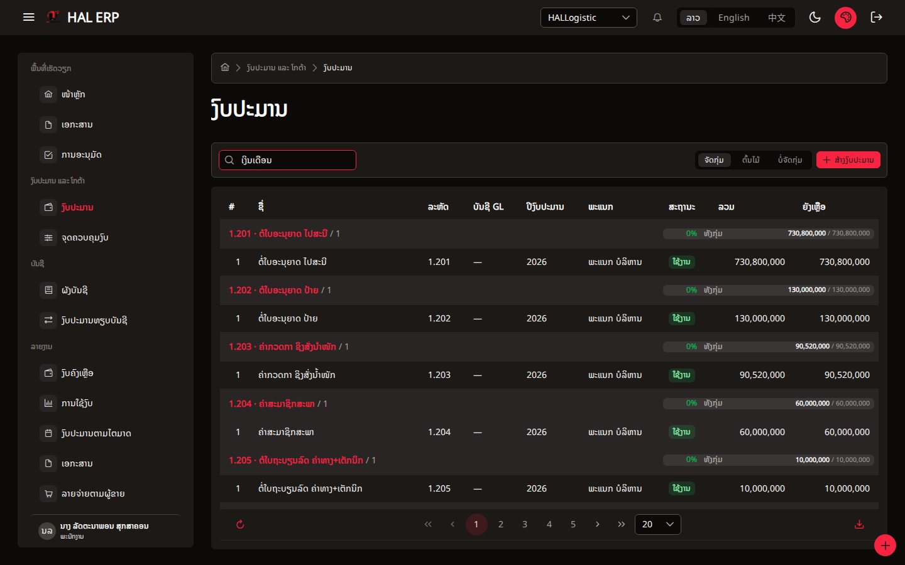

Typed `ເງິນເດືອນ` into ຄົ້ນຫາ on ງົບປະມານ. 40 rows before, 40 rows after, same first row, no
request sent. I retyped it twice and pressed Enter before accepting that the box is inert — that is
the hesitation this walk was meant to record.

`AppDataTable` runs PrimeVue's DataTable in `lazy` mode (server pagination). In lazy mode the
client-side `:filters` / `globalFilterFields` props are ignored. Every screen that pairs a
`PageToolbar` search with `:filters` on `AppDataTable` has the same dead box:

`AccountsAdminView` · `ApprovalConfigView` · `CurrencyAdminView` · `DeptMappingsView` ·
`JobLevelsAdminView` · `RbacAdminView` · `TaxCodesAdminView` · `WarehousesAdminView` ·
`ApprovalInboxView` · **`BudgetListView`** · **`ControlPointListView`** · `StockOnHandView` ·
`MasterDataView` · `ReadyToPayView` · `QuotaListView`

Two of them are the budget officer's main screens, holding 244 and 241 rows across 5 and 13 pages.
It also bites the admin: finding LATTANAPHONE in ສິດເຂົ້າເຖິງ → ຜູ້ໃຊ້ was impossible by search —
she is user 34 of 85, on page 2. I had to raise the page size to 100 to reach her.

### 3. A raw translation key is printed to the user

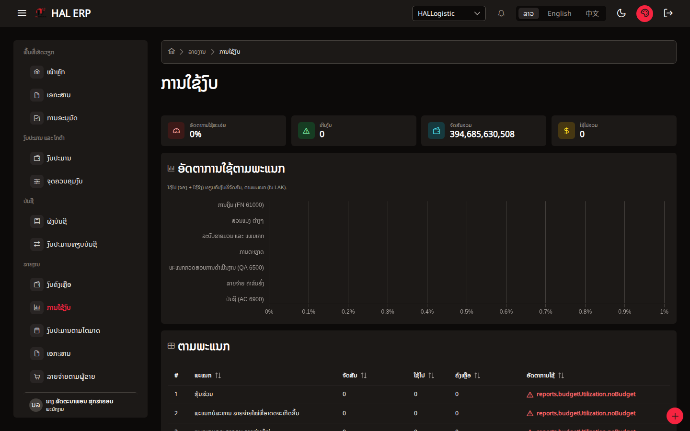

ລາຍງານ → ການໃຊ້ງົບ prints `reports.budgetUtilization.noBudget` in the ອັດຕາການໃຊ້ column, on
every department with no budget — which in this database is most of them.

The key exists as `reports.budgetBalance.noBudget` and `reports.budgetQuarter.noBudget` in all three
locales, but not under `budgetUtilization`, which is what `BudgetUtilizationReport.vue` asks for.
Because all three locales are wrong in the same way, the i18n parity spec passes: it compares the
locales with each other, never with the keys the views actually use.

### 4. The big red + button is WhatsApp

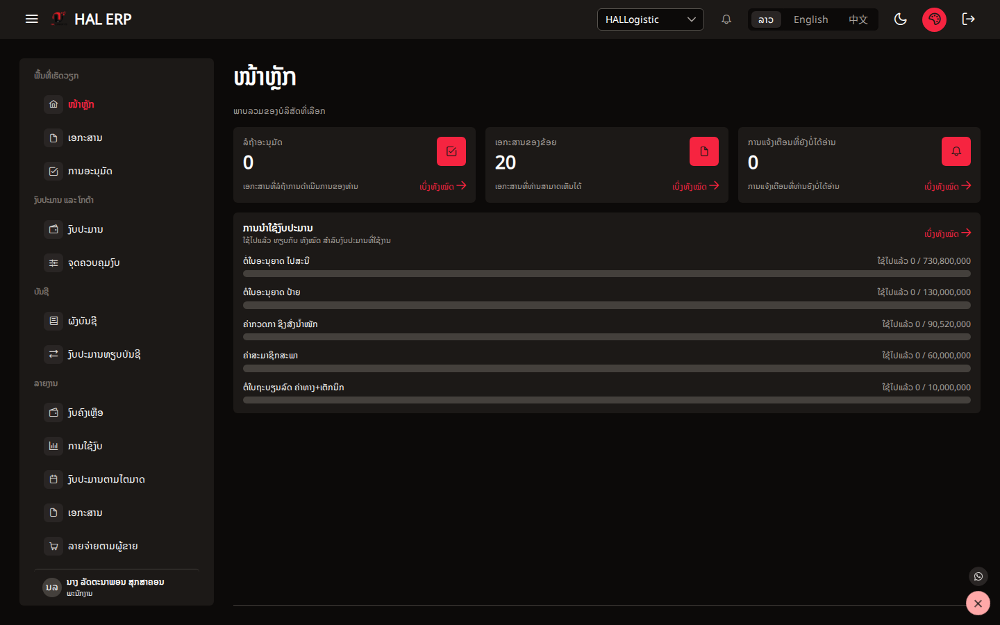

Bottom-right of every screen, a red circular button showing **+**. In an ERP that means "create".
It opens a single WhatsApp contact action. Its `aria-label` is `WhatsApp` on both the trigger and
the item, so a screen reader announces "WhatsApp" for what looks like the primary create button.

It was my first guess for "where do I raise a request", and it cost a click and a back-navigation.

### 5. A completed document with an empty approval history

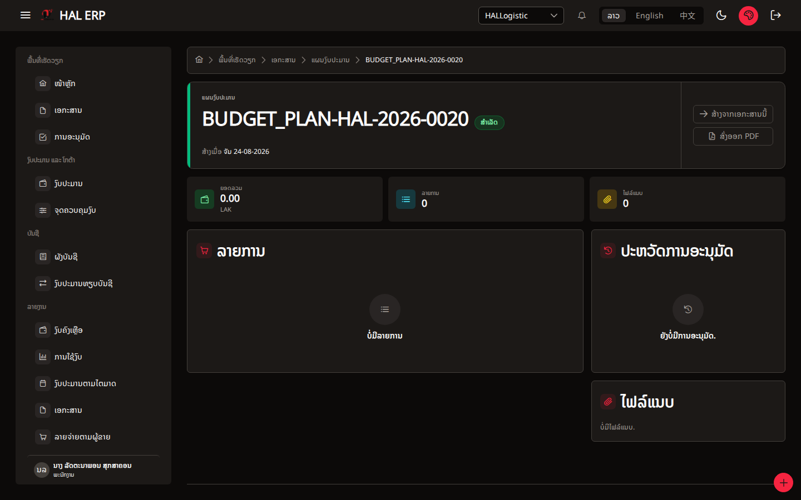

`BUDGET_PLAN-HAL-2026-0020` shows ສະຖານະ **ສຳເລັດ**, the list column reads
**ອະນຸມັດເອກະສານສຳເລັດ**, and the ປະຫວັດການອະນຸມັດ panel reads **ຍັງບໍ່ມີການອະນຸມັດ** — no
approvals yet. All 20 documents she can see say this.

They also read ຍອດລວມ **0.00 LAK** and ລາຍການ **0**, while together they carry the whole
394,685,630,508 of the 2026 plan. (Both are consequences of how the plan import wrote them — the
documents are real, the approval trail was never walked, and the money lives on the budgets rather
than on document lines. Nothing on the screen says so.)

### 6. Transferring budget can only reach 19 of the 244 budgets

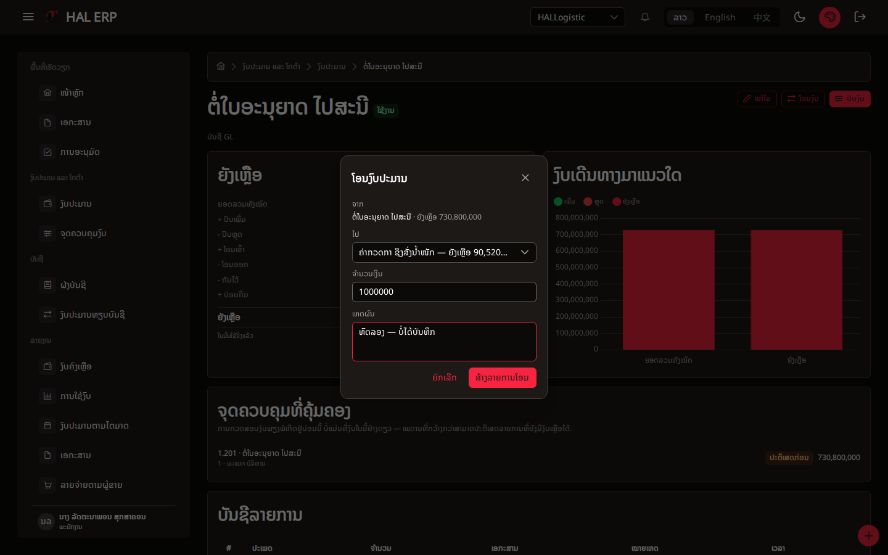

ງົບປະມານ → open a budget → ໂອນງົບ opens a clear dialog: ຈາກ (fixed), ໄປ, ຈຳນວນເງິນ, ເຫດຜົນ.

The ໄປ picker offers **19 options** — the 20 budgets on the currently loaded page, minus the source.
There are 244. There is no search inside the picker. A transfer from `1.201` to a budget in
department 7 cannot be expressed at all unless the operator first pages the list so that both happen
to be loaded.

**ສ້າງລາຍການໂອນ is also enabled with no destination and no amount chosen.** I did not click it.

### 7. The sidebar calls her ພະນັກງານ

Bottom-left shows **ນາງ ລັດຕະນາພອນ ສຸກສາຄອນ · ພະນັກງານ**. She holds two assignments —
`STAFF` (default) and `BUDGET_OFFICER` — and the chip shows the default one's name while the menu
she sees is built from the union of both. Somebody just given the budget-officer role sees the old
title and no confirmation that anything changed.

### 8. "ຢຸດໃຊ້" on quarters that were never used

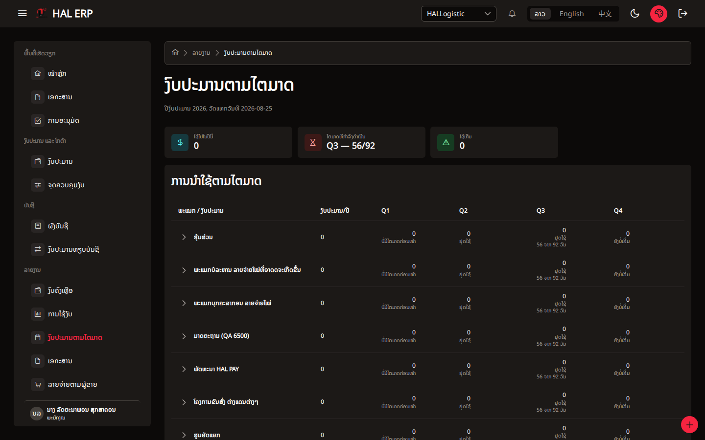

ລາຍງານງົບປະມານຕາມໄຕມາດ, every department: Q1 says ບໍ່ມີໄຕມາດກ່ອນໜ້າ (right), Q2 and Q3 say
**ຢຸດໃຊ້** — "stopped using". Nothing was ever spent in Q1 either. The comparison rule reads
"previous quarter zero and this quarter zero" as *stopped*, which reads as a fact about behaviour
that never happened. Q4 correctly says ຍັງບໍ່ເລີ່ມ.

### 9. Mobile: a quarterly report with no quarters on screen

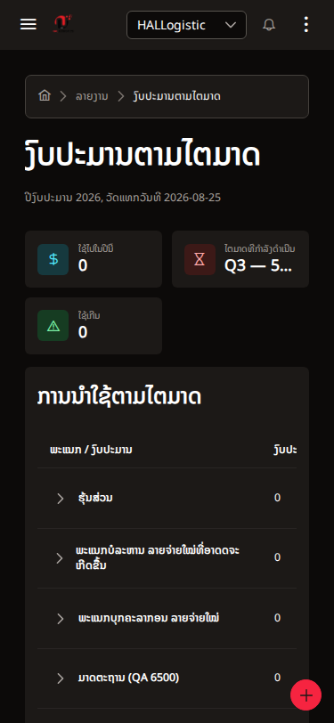

At 375px the ການນຳໃຊ້ຕາມໄຕມາດ table is 989px wide inside a 291px container. What is visible is the
department name and a column cut off at "ງົບປະ…". **Q1–Q4 are entirely off-screen.** The container
does scroll horizontally, so the data is reachable by swiping, but nothing on screen says there is
anything to the right. The KPI beside it truncates its value to `Q3 — 5…`.

Same shape on ເອກະສານ (1086px) and ງົບປະມານ (940px). No page overflows the viewport itself, so this
is "hostile", not "broken".

### 10. Two hundred and forty-one near-identical rows

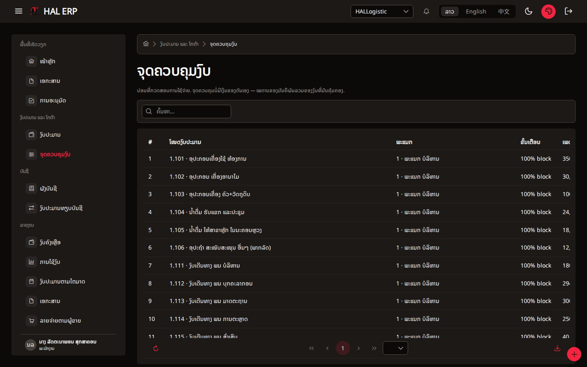

ຈຸດຄວບຄຸມງົບ lists 241 rows, one per budget, every one reading ຂັ້ນເຕືອນ 100% and ເພດານ = the
budget's own total. The explanatory line above it is good — *"ຈຸດຄວບຄຸມບໍ່ມີເງິນຂອງຕົນເອງ —
ເພດານຂອງມັນຄືຜົນລວມຂອງງົບທີ່ມັນຄຸ້ມຄອງ"*. What is missing is any reason to look at row 2 through
241.

### 11. Small things, in one place

- **ບັນຊີ GL** is a labelled field with nothing after it on the budget detail, and a column of "—"
  on the budget list. Budgets stopped naming a GL account; the label stayed.
- The budget list renders every budget **twice** — a group header (`1.201 · ຕໍ່ໃບອະນຸຍາດ ໄປສະນີ / 1`)
  and then one child row with the same name, code, total and remainder. 244 budgets, 488 lines.
- The ການກະທຳ column offers **ອະນຸມັດ** on all 20 documents. It is correctly disabled and its
  tooltip explains why — but the explanation only exists on hover, which does not exist on a phone.
- ງົບຄົງເຫຼືອ groups "ຕາມພະແນກ ແລະ ໝວດ" and its ໝວດ column shows bare codes — `10.101`, `10.102` —
  with no name.
- ອາຍຸການອະນຸມັດ stacks three tables that all say ບໍ່ມີເອກະສານລໍຖ້າອະນຸມັດ.

### What is right, and worth not breaking

- **ແກ້ໄຂງົບປະມານ** disables ຍອດລວມທັງໝົດ and the plan node, and says why:
  *"ເພື່ອປ່ຽນຍອດງົບປະມານ ໃຫ້ໃຊ້ການປັບງົບ — ຜ່ານການອະນຸມັດ"* and *"ປ່ຽນໜ່ວຍແຜນບໍ່ໄດ້: ເອກະສານ ແລະ
  ປະຫວັດອ້າງເຖິງງົບໃບນີ້ດ້ວຍລະຫັດນີ້"*. A budget's amount cannot be edited around the approval
  trail, and the screen explains the rule rather than just greying the field.
  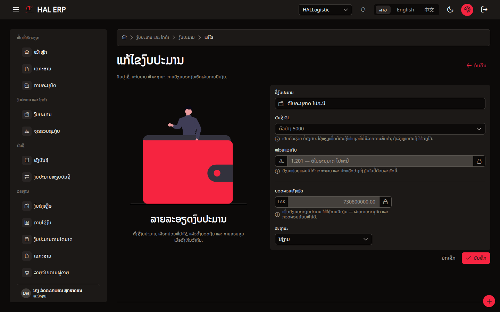
- The budget detail's ຍັງເຫຼືອ panel shows the balance as its formula, line by line
  (ຍອດລວມ + ປັບເພີ່ມ − ປັບຫຼຸດ + ໂອນເຂົ້າ − ໂອນອອກ − ກັນໄວ້ + ປ່ອຍຄືນ), with ໃນນັ້ນໃຊ້ຈິງແລ້ວ
  stated separately rather than subtracted. Somebody can check the system's arithmetic by eye.
- ຈຸດຄວບຄຸມທີ່ຄຸ້ມຄອງ on the budget detail says the check happens at the control point and that a
  wider ceiling can refuse a line that still has budget. That is the one thing about this system
  that is genuinely hard to guess, and it is written down where it is needed.
- The create wizard's dead end names the cause and who to ask.

---

## Words the UI uses

I can only report where the UI disagrees **with itself** — whether these match what a Lao budget
department says out loud is for the department to answer.

| word | where | the problem |
|---|---|---|
| **ເອກະສານຂອງຂ້ອຍ** | home card | titled "mine", counts "visible to me", and none of the 20 are hers |
| **ການອະນຸມັດ** | sidebar | means "documents awaiting *my* approval"; also the natural word for "the approval status of what I sent" |
| **ຢຸດໃຊ້** | quarterly report | says spending stopped where none ever started |
| **ໝວດ** | ງົບຄົງເຫຼືອ | column headed "category", shows a code |
| **ປັບງົບ / ໂອນງົບ** | budget detail | adjust vs transfer, side by side, one letter apart in Lao |
| **ຈຸດຄວບຄຸມງົບ** | sidebar | "budget control point" — a system concept with no counterpart in a spreadsheet; the screen explains it well, the menu label does not |
| **ບັນຊີ GL** | budget detail/list | labels a field that is always empty |

---

## Flows that cost more than three clicks

| goal | clicks | outcome |
|---|---|---|
| Raise a request for budget | 3 | **impossible** — no document type is reachable from her department |
| Find one budget by name among 244 | ∞ | **impossible by search**; page through 5 pages of 20 |
| Transfer budget to a specific line | 4 | reaches only the 19 budgets loaded on the current page |
| See the approval stage of a document | 3–4 | ເອກະສານ → row → detail → scroll to ປະຫວັດການອະນຸມັດ, after first trying ການອະນຸມັດ and finding it empty |
| See one department's quarterly usage | 3 | ລາຍງານ → ງົບປະມານຕາມໄຕມາດ → expand — the shortest real path in the app |
| See what a budget has consumed | 3 | ງົບປະມານ → page-hunt → open |

---

## What she sees and should not / should and does not

**Sees, and should not:**

- All 20 documents of department `PLAN` (§1). The severity is not today's 20 rows — it is that
  DEPARTMENT scope on `DOC_VIEW` is not enforced by the list at all.

**Should see, and does not:**

- Any way to raise a budget request (§the first question). `BUDGET_MANAGE` gives her ໂອນງົບ and
  ປັບງົບ from a budget's own page; it does not give her the document route those are supposed to
  travel, because her department has no `dept_doc_type` mapping.
- Any confirmation of what her role now is: the sidebar still says ພະນັກງານ (§7).
- Whether a report is empty because there is no data or because she is not allowed to see it.
  ໂກຕ້າຄົງເຫຼືອ, ລາຍຈ່າຍຕາມຜູ້ຂາຍ, ກວດສອບງົບປະມານ and ອາຍຸການອະນຸມັດ all render the same neutral
  "ບໍ່ມີ…" line, which here is honest — the database really is empty — and would look identical if
  it were not.

**Sees, and correctly so:** ຜັງບັນຊີ, ຂໍ້ມູນຫຼັກ, the eight reports, ຈຸດຄວບຄຸມງົບ. Nothing from
payments, payroll, inventory or attendance appears — the menu really is built from her permission
codes.

---

## Notes on method

- Every finding above was reproduced with a scripted browser against the live app using the saved
  session `.auth/staff.json`, at 1440×900 and 375×812.
- Nothing was written to `real_server` during this walk. The transfer dialog was filled and
  abandoned; ສ້າງລາຍການໂອນ was never clicked.
- One thing I got wrong and corrected: I first recorded ໂອນງົບ as a dead button. It is not — the
  dialog opens correctly; I had read the page text behind the modal. §6 reports what it actually
  does.
